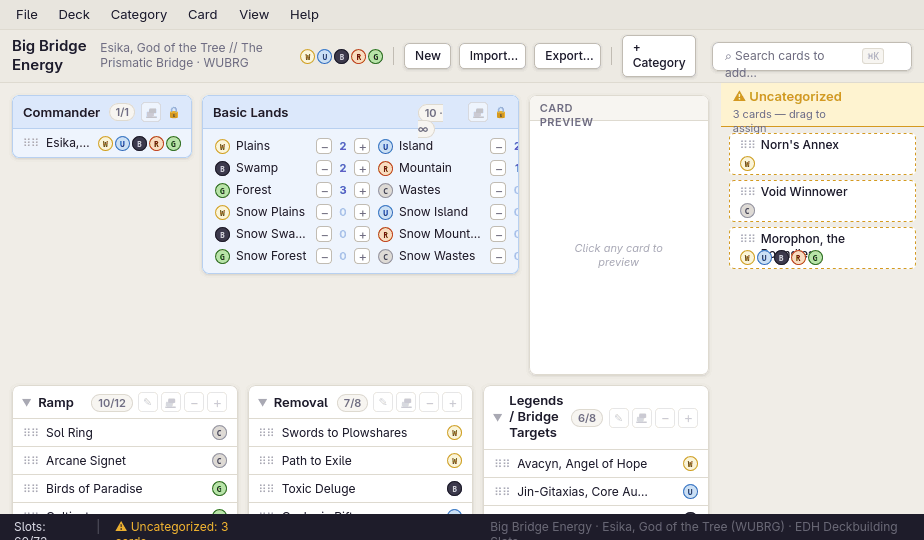
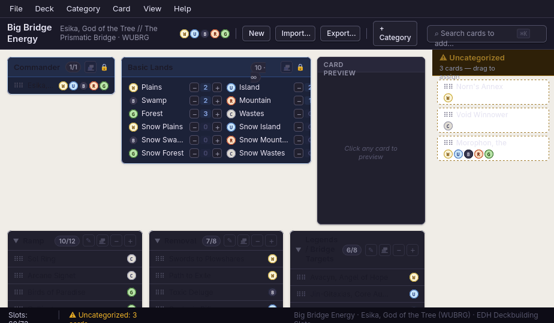
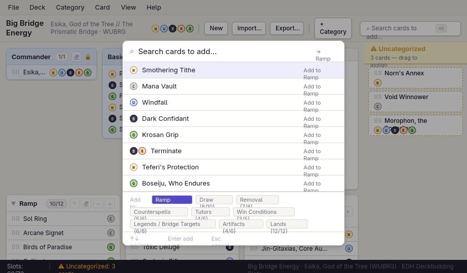
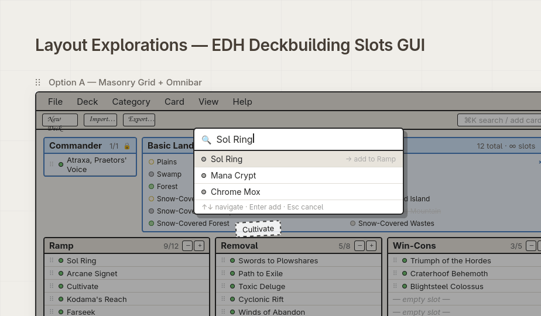

# Handoff: EDH Deckbuilding Slots

## Overview

**EDH Deckbuilding Slots** is a desktop-style deckbuilder for Magic: The Gathering Commander (EDH) decks. The core idea: a deck is built by allocating a fixed number of slots (typically 100 total) across **categories** (Ramp, Draw, Removal, Counterspells, Tutors, Win Conditions, Lands, etc.). The user resizes categories with `−` / `+` buttons, drags cards between them, and the app constantly shows where slots are filled, where they're over/under, and which cards still need a home.

Two fixed categories always exist:
- **Commander** — exactly 1 slot, locked.
- **Basic Lands** — uncapped (∞), shows all 12 basic land types as a grid with per-land counters.
- **Uncategorized** — a holding pen for cards that don't yet belong to a real category; shown as a dashed-border sidebar.

The hero file is **`Big Bridge Energy.html`** — a hi-fi, fully interactive prototype themed around an Esika, God of the Tree (WUBRG) deck called "Big Bridge Energy." This is the design to recreate.

The supporting file **`EDH Deckbuilding Slots — Wireframes.html`** is a 3-option wireframe exploration (Masonry / Horizontal Bands / Sidebar+Focus). It's included for context — **Option A (Masonry)** is what the hi-fi prototype is based on. The wireframes show alternate layouts that were considered.

## Screenshots

| | |
|---|---|
|  |  |
| **Big Bridge Energy** — light theme (default) | Dark theme |
|  |  |
| Omnibar (⌘K) — card search + category targeting | Wireframe exploration — three layout options |

## About the Design Files

The files in this bundle are **design references created in HTML** — clickable prototypes that show intended look and behavior. They are **not production code to ship**. The task is to **recreate these designs in the target codebase's existing environment** (React, Vue, Svelte, SwiftUI, Tauri/Electron, etc.) using its established patterns, component library, and state management. If no environment exists yet, choose the most appropriate framework for the project (React + Vite is a reasonable default for a desktop-style web app, or Tauri/Electron if it should ship as a native desktop binary — the design intentionally evokes a desktop app with menu bar, toolbar, and status bar).

The HTML prototypes use:
- React 18 via `<script>` + Babel standalone (for inline JSX)
- All state in `useState` / `useCallback` in a single root `App` component
- DOM-native HTML5 drag-and-drop
- Scryfall API (`https://api.scryfall.com/cards/named?fuzzy=…`) for live card images when the "Scryfall images" tweak is on
- Google Fonts: **DM Sans** (hi-fi) and **Caveat** (wireframes)

When recreating, you should:
- Split the monolithic root component into proper components (`CategoryTile`, `BasicLandsTile`, `CommanderTile`, `UncategorizedSidebar`, `Omnibar`, `CardPreviewPane`, `Statusbar`, `Toolbar`, `Menubar`).
- Use whatever state library your codebase prefers (Redux, Zustand, Jotai, signals, etc.) — the design's state shape is simple (see **State Management** below).
- Use the codebase's existing drag-and-drop library (e.g. `@dnd-kit`, `react-dnd`) instead of raw HTML5 drag events. The intended behavior is the same.
- Use the codebase's existing icon set in place of inline SVG/emoji where one exists.

## Fidelity

**High-fidelity (hifi).** `Big Bridge Energy.html` is intended to be pixel-perfect: final colors, typography, spacing, interactions, drag affordances, theming (light/dark), density toggle, status bar, omnibar, and card preview pane are all final. Recreate visually faithfully.

The wireframes file is **low-fidelity** and shown only for layout context — do not try to match its hand-drawn Caveat-font aesthetic.

## Screens / Views

The hi-fi design is a single-screen desktop-style application. Top to bottom:

### 1. Menu Bar (height 30px)
Fixed bar with menu items: `File · Deck · Category · Card · View · Help`.
- Background `var(--menu-bg)` (#e8e5de light / #1c1b28 dark)
- 1px bottom border `var(--border)`
- Menu items: `font-size: 13px`, `padding: 3px 10px`, hover → accent purple background, white text.

### 2. Toolbar (auto height, ~36px)
Horizontal flex bar with:
- **Deck name** "Big Bridge Energy" — `font-size: 15px; font-weight: 600`
- **Deck sub** "Esika, God of the Tree // The Prismatic Bridge · WUBRG" — `12px var(--text-sub)`
- **Mana row** — five `ManaBadge` pips (W,U,B,R,G) inline
- **Separators** (1px × 18px vertical dividers, `var(--border-s)`)
- **Buttons**: `New`, `Import…`, `Export…` (group 1) and `+ Category` (group 2). Each = `tool-btn` style: white panel bg, 1px border, 5px radius, subtle shadow.
- **Flex spacer**
- **Omnibar trigger** (right-aligned): rounded input-like affordance showing `⌕ Search cards to add…` with a `⌘K` keyboard chip. Clicking opens the omnibar overlay.

### 3. Main Body (flex: 1, scrollable)
The body is a horizontal flex row:
- **Main scroll area** (flex: 1) — contains the pinned row + masonry of categories
- **Uncategorized sidebar** (220px fixed width, right side) — dashed left border

#### 3a. Pinned row (inside main scroll, at top)
A 3-column horizontal flex row:
1. **Commander tile** (180px fixed) — single category tile, blue "fixed" tint, locked icon. Always shows exactly 1 card (or "drop commander here" empty state).
2. **Basic Lands tile** (flex: 1) — blue fixed tint. Header has color-breakdown popover on hover. Body is a 2-column grid of all 12 basic types (Plains/Island/Swamp/Mountain/Forest/Wastes × regular & snow-covered). Each row shows: mana badge · land name · −/count/+ stepper buttons. Land types outside the deck's color identity are greyed out with line-through and a `✕` marker.
3. **Card Preview Pane** (180×280 fixed) — shows the most-recently clicked card. If the **Scryfall images** tweak is on, fetches the real card image. Otherwise shows a hand-drawn placeholder card face (title bar, art area, type line, oracle text area, P/T corner).

#### 3b. User-category masonry (below pinned row)
CSS multi-column layout (`columns: 3; column-gap: 10px`). Each user-defined category renders as a **`CatTile`**:
- White panel, 1px border, 7px radius, subtle shadow.
- **Header row** (`cat-hdr`):
  - Chevron `▶` (rotates 90° when open)
  - Category name (click to collapse, double-click row → rename inline via `cat-rename-input`)
  - **Color stat badge** (`cat-count`): pill like `8/12`, shows accent-purple "full" state. On hover, popover with per-color horizontal bar chart of mana symbols across the category's cards.
  - **Header actions** (visible at 35% opacity, 100% on hover):
    - `✎` rename
    - 🗑 dump-to-Uncategorized icon (custom 14×14 SVG: two stacked rectangles + bottom line, like a tipping dustbin)
    - `−` / `+` slot resize buttons
  - Lock 🔒 icon for fixed categories instead of the resize/rename buttons.
- **Card list** (collapsed when chevron closed):
  - Each card = `card-row`: drag handle `⠿⠿` · truncated card name (max 22 chars, `…`) · mana row.
  - `min-height: 28px`, `padding: 4px 10px`, 1px bottom border between rows.
  - Click → selects card (highlights row with accent-bg left-border), fills the Card Preview Pane.
  - Drag → triggers card move; source row dims to 40% opacity.
  - Trailing empty slot rows: italic dim "— empty slot —" up to 2 (compact) or 3 (comfortable). If more empties remain, an `overflow-note` shows `+N more empty slots`.

#### 3c. Uncategorized sidebar (right side, 220px)
- 2px **dashed** left border, color `var(--uncat-bdr)` (#d49820 / amber).
- Cream/yellow tinted background `var(--uncat-bg)`.
- Header: ⚠ icon, "Uncategorized" title, sub-text showing count or "All cards placed ✓".
- Body: vertical list of `uncat-chip`s — each is a draggable card chip with dashed amber border, drag handle, card name, mana row.
- Drop target accepts cards dragged from any category (un-assigns them).

### 4. Status Bar (height 26px, dark)
- Dark background `var(--status-bg)` (near-black, slightly purple-tinged).
- Light text `var(--status-fg)`.
- Left: `Slots: 78/100` — green when full (`status-ok`), white otherwise.
- Separator `|`.
- Warnings: amber `⚠ Uncategorized: 3 cards` for each problem; green `✓ All cards placed` when clean.
- Right (subtle, .4 opacity): deck name and commander identity.

### 5. Omnibar overlay (modal)
Opens via `⌘K` / `Ctrl+K` or clicking the toolbar omnibar trigger.
- Fixed full-viewport overlay, `rgba(0,0,0,.35)` backdrop, content top-anchored 80px from top.
- White rounded 10px panel, 440px wide, drop shadow.
- **Input row**: `⌕` icon, text input "Search cards to add…", right-side target label `→ {currentTarget.name}`.
- **Results list**: max 8 results from `CARD_POOL`, fuzzy match against query. Each result row = mana row · card name · "Add to {target}" sub-label. Up/Down arrow keys cycle the active row (background `var(--accent-bg)`); hover does the same.
- **Category target chooser**: below results, a wrapping row of pill chips for each non-fixed user category showing `{name} ({filled}/{slots})`. Active chip uses accent purple bg + white text.
- **Hint row**: `↑↓ navigate · Enter add card · Esc cancel`.
- Default target = the first non-full, non-fixed user category (auto-picked).

## Interactions & Behavior

### Drag & Drop
- Every `card-row` and `uncat-chip` is `draggable`.
- On `dragstart`: store `{card, fromCatId}` in app state (`dragging`); also select the card so the preview updates.
- On `dragover` over a category tile: set `dragOverCat` → tile gets `drag-over` class (accent purple border, tinted bg, faint outer glow).
- On `drop`: move card from source → target. If target is full (`cards.length >= slots`, not uncapped), **silently reject** (no error, card stays put). If `fromCatId === toCatId`, no-op.
- Uncategorized → any category and any category → Uncategorized are both valid moves.

### Slot resize
- `+` button: `slots += 1`
- `−` button: `slots = Math.max(cards.length, slots - 1)` (can't shrink below what's filled).
- Slot deltas are local to the category; total deck slots are derived in the status bar.

### Collapse/expand
- Click on the category header (anywhere not on action buttons or the rename input) → toggles `collapsed.has(catId)`.
- Chevron `▶` → rotates 90° when expanded.
- Collapsed tiles show only the header.

### Rename category
- Click the `✎` button in header actions.
- Header swaps in an inline input (`cat-rename-input`) with the current name pre-selected.
- Enter or blur commits; Escape cancels.
- Whitespace-trimmed; empty / unchanged values do nothing.

### Dump category
- Click the 🗑 (custom dustbin SVG) button in header actions.
- Moves all cards from that category into Uncategorized.
- Category itself remains (slots and name preserved), just empty.
- Works for both fixed and user categories.

### Basic lands
- `+` / `−` per land row: adds/removes one of that exact land type.
- Double-click on a basic row enters an inline edit mode (number input). Enter commits to the absolute count; Escape cancels.
- The color-breakdown popover on the count badge shows a stacked bar per color: solid fill = regular basics, hatched fill = snow-covered. Snow count appended as `❄N` if non-zero.
- Lands outside `DECK_IDENTITY` are 28% opacity, line-through, no stepper, `✕` marker.

### Card click
- Selects the card (visible accent-bg row highlight) and updates the Card Preview pane on the right.

### Card Preview pane
- **Default mode**: render an internal `wf-card-face` (placeholder with title, art-area, type line, oracle text area, P/T corner).
- **Scryfall mode** (tweak): fetch `https://api.scryfall.com/cards/named?fuzzy={card.name}`, cache by name, render `image_uris.normal` (or first face's image for double-faced cards). Show "Loading…" / "Image unavailable" states.
- When no card is selected: italic placeholder "Click any card to preview".

### Keyboard
- `⌘K` / `Ctrl+K`: toggle omnibar.
- Inside omnibar: `↑` / `↓` cycle results, `Enter` add active, `Esc` close.

### Theming
- `data-theme="light"` (default) or `data-theme="dark"` on the root element.
- All colors use CSS variables — see **Design Tokens** below.
- Toggled via the **Tweaks** panel.

### Density
- `comfortable` shows up to 3 empty-slot rows per category; `compact` shows up to 2.
- Toggled via the **Tweaks** panel.

## State Management

The whole app's state shape is small. Recreate in whatever state library the codebase uses:

```ts
type Card = { id: number; name: string; colors: ("W"|"U"|"B"|"R"|"G"|"C")[] };

type Category = {
  id: string;             // "ramp", "draw", "commander", "basiclands", "uncat", ...
  name: string;
  fixed: boolean;         // commander, basiclands, uncat
  slots: number;          // capacity (ignored if uncapped)
  uncapped: boolean;      // basiclands, uncat
  isBasics?: boolean;     // marks the Basic Lands category
  isUncat?: boolean;      // marks the Uncategorized holding pen
  cards: Card[];
};

// App state:
cats: Category[];
omniOpen: boolean;
dragging: { card: Card; fromCatId: string } | null;
collapsed: Set<string>;           // catIds that are collapsed
dragOverCat: string | null;       // which tile currently has dragover
selectedCard: Card | null;        // for the preview pane
tweaks: { theme: "light"|"dark"; density: "comfortable"|"compact"; scryfallMode: boolean };
```

Key transitions:
- `moveCard(card, fromId, toId)` — splice from source, push to target (if not full).
- `addCard(card, toCatId)` — push to target (omnibar).
- `resizeSlot(catId, ±1)` — clamped at `cards.length` floor.
- `basicAdd / basicRemove / basicSet` — only operate on the Basic Lands category; remove pops the *last* occurrence of that name.
- `renameCategory(catId, newName)` and `dumpCategory(catId)` (preserves category, moves cards to Uncat).
- `toggleCollapse(catId)`.

The omnibar uses an internal `CARD_POOL` array of 18 sample cards for fuzzy-match. In production, this should query a real card catalog (Scryfall's `/cards/search?q=...` is the standard).

## Design Tokens

All values from `Big Bridge Energy.html`. Two themes — recreate as CSS variables or your platform's equivalent.

### Light theme
```
--bg:          #f0ede7   /* app background */
--panel:       #ffffff   /* tiles, cards, omnibar */
--panel2:      #f7f5f1   /* hover, secondary bg */
--border:      #dedad0
--border-s:    #c0bbb0
--text:        #1a1826
--text-sub:    #706c84
--text-dim:    #a8a4b8
--accent:      #5248c8   /* purple — selection, focus, "full" state */
--accent-bg:   #eeedfb
--accent-text: #3830a0
--fixed-bg:    #eef4fd   /* commander, basic-lands tile bg */
--fixed-bdr:   #b8d0f0
--fixed-hdr:   #dce8fb
--uncat-bg:    #fffbf0   /* uncategorized sidebar */
--uncat-bdr:   #d49820
--uncat-hdr:   #fef3d0
--menu-bg:     #e8e5de
--tool-bg:     #edeae3
--status-bg:   #1e1c2a
--status-fg:   #d8d6e8
--scrollbar:   #ccc
--drag-over:   #e8e6fb
--drag-bdr:    #5248c8
--shadow:      0 1px 3px rgba(0,0,0,.08), 0 1px 2px rgba(0,0,0,.06)
--shadow-md:   0 4px 12px rgba(0,0,0,.12), 0 2px 4px rgba(0,0,0,.08)
```

### Dark theme
```
--bg:          #16151f
--panel:       #21202e
--panel2:      #28273a
--border:      #363448
--border-s:    #504e68
--text:        #e8e6f4
--text-sub:    #9290a8
--text-dim:    #5a5870
--accent:      #8b7ff0
--accent-bg:   #26244a
--accent-text: #b0a8f8
--fixed-bg:    #1c2238
--fixed-bdr:   #304880
--fixed-hdr:   #222c48
--uncat-bg:    #221c0e
--uncat-bdr:   #a07820
--uncat-hdr:   #2e2008
--menu-bg:     #1c1b28
--tool-bg:     #1a1928
--status-bg:   #0d0c16
--status-fg:   #c8c6dc
--scrollbar:   #444
--drag-over:   #2a2848
--drag-bdr:    #8b7ff0
```

### MTG Mana colors (for badges + popovers)
```js
const MANA_S = {
  W: { bg:"#faf5d8", bd:"#c4a820", fg:"#6b5410" },  // white
  U: { bg:"#c8e4f8", bd:"#2870c0", fg:"#134878" },  // blue
  B: { bg:"#3a3450", bd:"#1a1430", fg:"#d0c8e8" },  // black
  R: { bg:"#fcd8c0", bd:"#c03010", fg:"#701006" },  // red
  G: { bg:"#b8e4a8", bd:"#286820", fg:"#0e4010" },  // green
  C: { bg:"#e0dcd8", bd:"#9090a0", fg:"#404050" },  // colorless
};

// Bar chart fills:
const COLOR_HEX = {
  W:"#f5e87a", U:"#5b9bd5", B:"#9b59b6", R:"#e74c3c", G:"#27ae60", C:"#95a5a6",
};
```

### Typography
- Family: **`"DM Sans", system-ui, sans-serif`** (Google Font, weights 400/500/600/700, variable optical-size 9–40)
- Body: `13px` regular
- Card name in row: `12px`
- Cat name in header: `13px / 600`
- Deck name in toolbar: `15px / 600`
- Status bar: `12px`
- Sub-text & dim labels: `10–12px var(--text-sub | text-dim)`
- Card mana pip glyph: `8px / 800 monospace`, uppercase single-letter
- Antialiasing on

### Spacing / Sizing
- Menu bar height `30px`; toolbar `~36px`; status bar `26px`
- Tile border-radius `7px`; pill/chip `10–14px`; button `4–5px`
- Header row padding `6px 10px`; card row padding `4px 10px` min-height `28px`
- Drop-zone hover: 2px outer accent border + tinted bg
- Card preview pane fixed `180 × 280px`
- Uncategorized sidebar fixed `220px` width
- Pinned row gap `10px`; masonry column-gap `10px`
- Slot button `20 × 20px` (basic stepper `16 × 16px`)
- Mana badge `15 × 15px` circle

### Shadows
- Default: `0 1px 3px rgba(0,0,0,.08), 0 1px 2px rgba(0,0,0,.06)`
- Modal/popover: `0 4px 12px rgba(0,0,0,.12), 0 2px 4px rgba(0,0,0,.08)`

## Assets

No raster assets. Everything is:
- **Custom SVGs inline** — only the dustbin icon (14×14, in `CatTile` and `BasicLandsTile`). All other icons are unicode glyphs: `▶ ✎ − + ⠿ ⌕ 🔒 ⚠ ✓ ✕ ❄ ⌘K`.
- **External font** — DM Sans via Google Fonts.
- **External API (optional)** — Scryfall (`https://api.scryfall.com/cards/named`) when the user enables the "Scryfall images" tweak. Should be replaced with the codebase's standard card-data provider if one exists.

Replace any unicode glyphs with the codebase's existing icon set if one is in use (Lucide, Phosphor, Heroicons, Tabler, etc.). The dustbin SVG is custom and should be preserved or replaced with a matching trash/dump icon.

## Files

| File | Purpose |
|---|---|
| `Big Bridge Energy.html` | **Hi-fi prototype — the design to recreate.** Fully interactive, themed (light/dark), tweakable. |
| `EDH Deckbuilding Slots — Wireframes.html` | Lo-fi exploration — three layout options. Option A (Masonry) was selected and is what the hi-fi is based on. Included for context only. |
| `tweaks-panel.jsx` | Vendored helper used by the hi-fi prototype for its tweak panel. **Not part of the design** — your codebase's own settings/preferences UI should host the same controls (theme · density · Scryfall images toggle). |
| `design-canvas.jsx` | Vendored helper used by the wireframes file. Not part of the design. |

To preview the prototypes locally, just open the HTML files in a browser — no build step needed.

## Open Questions for Implementation

A few things the prototype mocks but production should clarify:

1. **Card data source** — is there a real card database / Scryfall integration target? The omnibar's 18-card sample pool needs to become a real search.
2. **Persistence** — the prototype is in-memory only. Where does a deck save to (localStorage / SQLite / cloud)?
3. **Deck import/export format** — the toolbar has `Import…` / `Export…` buttons but they're no-ops. Decked Builder `.dec`, Moxfield JSON, MTGA `.txt` are the common formats.
4. **Multi-deck management** — only one deck at a time is mocked. If users have many decks, a deck picker (file menu? sidebar?) is needed.
5. **Reorder categories** — the prototype lists categories in source order; production likely wants drag-to-reorder of the categories themselves.
6. **Add new category** — the `+ Category` button is a no-op in the prototype; needs a modal or inline-add affordance.
7. **Format/legality validation** — Commander legality, color identity for non-basics, banlist warnings — none of this is modeled.
